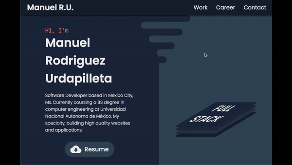

# My Personal Portfolio

This is my first fully responsive personal developer portfolio.
#

## How was this built?
- Figma - Wireframe (UI)
- HTML
- CSS/SASS

## What did I learn?
- Syntax and functionality of SASS extension language.
- Animation inside css using the `transform` and `animate` properties.
- Vector graphics and `<svg>` implementation in HTML.
- Flexbox and css grid.

## Desktop

  

## Mobile

## Note
This website is not hosted yet. Development has stopped until enough projects are finished for display.

#
Manuel Rodriguez Urdapilleta

30/04/2021

